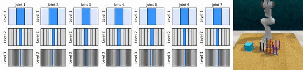
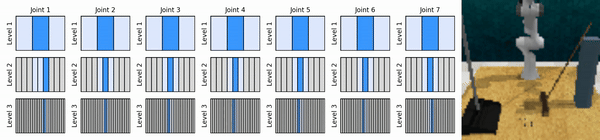

# Coarse-to-fine Q-Network with Action Sequence

This repository provides the re-implementation of Coarse-to-fine Q-Network (**CQN**) and Coarse-to-fine Q-Network with Action Sequence (**CQN-AS**), introduced in:

[**Continuous Control with Coarse-to-fine Reinforcement Learning**](https://younggyo.me/cqn/)\
[Younggyo Seo](https://younggyo.me/), [Jafar Uruç](https://github.com/JafarAbdi), [Stephen James](https://stepjam.github.io/)\
CoRL 2024

[**Reinforcement Learning with Action Sequence for Data-Efficient Robot Learning**](https://younggyo.me/cqn-as/)\
[Younggyo Seo](https://younggyo.me/), [Pieter Abbeel](https://people.eecs.berkeley.edu/~pabbeel/)\
Preprint

In summary, **CQN** is a sample-efficient value-based RL algorithm that uses *discrete actions* for solving continuous control problems.
The key idea is to apply multiple levels of discretization to continuous action space, and train RL agents to zoom-into continuous action space in a coarse-to-fine manner.

**CQN-AS** extends **CQN** by training a critic network that outputs *Q-values over a series of actions*, allowing for learning useful value functions from noisy training data such as human-collected demonstrations.

We also provide implementation of **DrQ-v2+**, a variant of DrQ-v2 that is highly optimized for demo-driven RL setup, along with the implementation of **DrQ-v2-AS+** that incorporates action sequence into **DrQ-v2+**.




## Misc
- We adopt a domain-based code maintenance design to avoid having a too complex code design. In other words, instead of having a shared code that can be used for all domains, we maintain a separate set of files for each domain.
- This codebase might not fully reproduce the experiments in the paper due to potential human errors in porting code. Please let us know if you encounter any discrepancy in the performance between the reported results and the results from running this code.

## TO-DO List
- [ ] Refactor to use `ReplayBuffer`, `LazyTensorStorage` of `torchrl`
- [ ] Refactor to replace numpy-based TemporalEnsemble implementation with torch-based implementation
- [ ] Check if the code fully reproduces the results in the paper.

## Experimental Setups
Our codebase supports running CQN and CQN-AS on various domains popular for researchers. We plan to support more domains and any PR or suggestion to support more domains (including yours) is welcome!

| Domain | State-based | Pixel-based | Action Seqeunce | Demo-driven | Stable |
|-|-|-|-|-|-|
| [BiGym](https://github.com/chernyadev/bigym) | :x: | :white_check_mark: | :white_check_mark: | :white_check_mark: |:white_check_mark:|
| [RLBench](https://github.com/stepjam/RLBench) | :x: | :white_check_mark:| :white_check_mark: | :white_check_mark: |:white_check_mark:|
| [HumanoidBench](https://github.com/carlosferrazza/humanoid-bench) | :white_check_mark: | :x: | :white_check_mark: | :x: |:white_check_mark:|
| [DMC](https://github.com/google-deepmind/dm_control) | :white_check_mark: | :white_check_mark: | :x: | :white_check_mark: |:warning:|


## Installation
Install conda environment:
```
conda env create -f conda_env.yml
conda activate cqn
```

For faster experiments, install the nightly version of PyTorch, and set `use_compile` and `use_cuda_graph` to True.
```
pip3 install --pre torch torchvision torchaudio --index-url https://download.pytorch.org/whl/nightly/cu124
```

## Instructions for BiGym experiments

Install BiGym (latest version at the date of Oct 29th should be used).

```
git clone https://github.com/chernyadev/bigym.git
cd bigym
git checkout 72d305437d5a13800ea633479a1060619fc14e54
pip install -e .
```

BiGym will download demonstrations and save pre-processed cache in the first run of each task, so there is no need for each user to handle demonstrations by themselves.
Our code also automatically handles demonstrations that can't be replayed by saving them as training data but not demonstration data.

Run experiments (CQN and CQN-AS):
```
# Run CQN
CUDA_VISIBLE_DEVICES=0 MUJOCO_EGL_DEVICE_ID=0 python train_cqn_bigym.py bigym_task=move_plate seed=1

# Run CQN-AS (Ours)
CUDA_VISIBLE_DEVICES=0 MUJOCO_EGL_DEVICE_ID=0 python train_cqn_as_bigym.py bigym_task=move_plate seed=1

# Run DrQ-v2+
CUDA_VISIBLE_DEVICES=0 MUJOCO_EGL_DEVICE_ID=0 python train_drqv2plus_bigym.py bigym_task=move_plate seed=1

# Run DrQ-v2-AS+ (Ours)
CUDA_VISIBLE_DEVICES=0 MUJOCO_EGL_DEVICE_ID=0 python train_drqv2plus_as_bigym.py bigym_task=move_plate seed=1
```

**Warning**: DrQ-v2-AS+ is not extensively tested

## Instructions for RLBench experiments

Install RLBench and PyRep (latest versions at the date of Oct 29th, 2024 should be used).
Follow the guide in original repositories for (1) installing RLBench and PyRep and (2) enabling headless mode. (See README in [RLBench](https://github.com/stepjam/RLBench) \& [Robobase](https://github.com/robobase-org/robobase?tab=readme-ov-file#rlbench) for information on installing RLBench.)

```
git clone https://github.com/stepjam/RLBench
git clone https://github.com/stepjam/PyRep
# Install PyRep
cd PyRep
git checkout 8f420be8064b1970aae18a9cfbc978dfb15747ef
pip install .
# Install RLBench
cd RLBench
git checkout b80e51feb3694d9959cb8c0408cd385001b01382
pip install .
```

Pre-collect demonstrations
```
cd RLBench/rlbench
CUDA_VISIBLE_DEVICES=0 DISPLAY=:0.0 python dataset_generator.py --save_path=/your/own/directory --image_size 84 84 --renderer opengl3 --episodes_per_task 100 --variations 1 --processes 1 --tasks take_lid_off_saucepan --arm_max_velocity 2.0 --arm_max_acceleration 8.0
```

Run experiments :
```
# Run CQN
CUDA_VISIBLE_DEVICES=0 DISPLAY=:0.0 python train_cqn_rlbench.py rlbench_task=take_lid_off_saucepan num_demos=100 dataset_root=/your/own/directory

# Run CQN-AS (Ours)
CUDA_VISIBLE_DEVICES=0 DISPLAY=:0.0 python train_cqn_as_rlbench.py rlbench_task=take_lid_off_saucepan num_demos=100 dataset_root=/your/own/directory

# Run DrQ-v2+
CUDA_VISIBLE_DEVICES=0 DISPLAY=:0.0 python train_drqv2plus_rlbench.py rlbench_task=take_lid_off_saucepan num_demos=100 dataset_root=/your/own/directory

# Run DrQ-v2-AS+ (Ours)
CUDA_VISIBLE_DEVICES=0 DISPLAY=:0.0 python train_drqv2plus_as_rlbench.py rlbench_task=take_lid_off_saucepan num_demos=100 dataset_root=/your/own/directory
```

**Warning**: DrQ-v2-AS+ is not extensively tested

## Instructions for HumanoidBench experiments

Install HumanoidBench
```
git clone https://github.com/carlosferrazza/humanoid-bench.git
cd humanoid-bench
pip install -e .
```

**Note**: HumanoidBench requires `opencv-python==4.10.0.84` to be installed but this can cause RLBench experiments to fail. In that case, uninstall `opencv-python==4.10.0.84` and install `opencv-python-headless==4.10.0.84`. You can run both experiments with a single virtual environment with headless opencv.


Run experiments:
```
# Run CQN
CUDA_VISIBLE_DEVICES=0 MUJOCO_EGL_DEVICE_ID=0 python train_cqn_humanoid.py task_name=h1hand-stand-v0

# Run CQN-AS
CUDA_VISIBLE_DEVICES=0 MUJOCO_EGL_DEVICE_ID=0 python train_cqn_as_humanoid.py task_name=h1hand-stand-v0
```

Note that `h1hand` is different from `h1` and `h1hand` is the default task used in the original benchmark.

## Instructions for DMC experiments

Run experiments:
```
# For pixel-based experiments
CUDA_VISIBLE_DEVICES=0 python train_cqn_dmc.py dmc_task=cartpole_swingup

# For state-based experiments
CUDA_VISIBLE_DEVICES=0 python train_cqn_dmc_state.py dmc_task=cartpole_swingup
```

**Warning**: CQN is not extensively tested in DMC


## Acknowledgements
This repository is based on public implementation of [DrQ-v2](https://github.com/facebookresearch/drqv2)


## Citation
```
# CQN
@inproceedings{seo2024continuous,
  title={Continuous Control with Coarse-to-fine Reinforcement Learning},
  author={Seo, Younggyo and Uru{\c{c}}, Jafar and James, Stephen},
  booktitle={Conference on Robot Learning},
  year={2024}
}

# CQN-AS
@article{seo2024reinforcement,
  title={Reinforcement Learning with Action Sequence for Data-Efficient Robot Learning},
  author={Seo, Younggyo and Abbeel, Pieter},
  journal={arXiv preprint arXiv:2411.12155},
  year={2024}
}
```